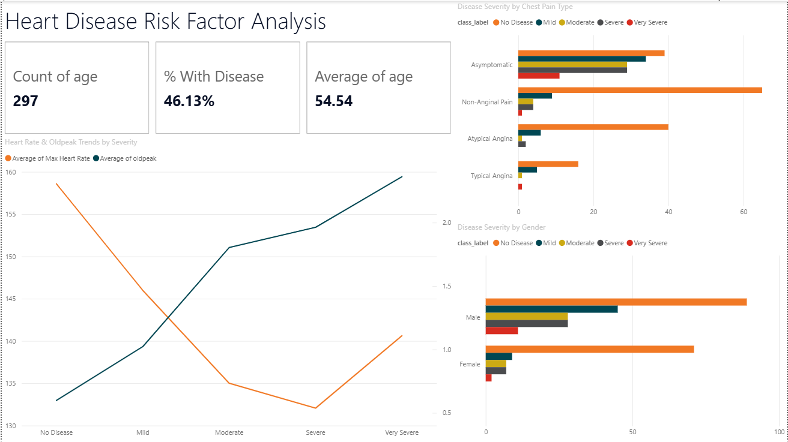

# Heart Disease Risk Factor Analysis

Data cleaning and exploratory analysis in Python, visualized as an interactive Power BI dashboard.

**Dataset:** UCI Cleveland Heart Disease Dataset — 303 patients, 14 clinical variables, disease severity target (0 = no disease, 1–4 = increasing severity)

**Tools:** Python (pandas, seaborn, matplotlib), Power BI (DAX, Power Query)

---

## 📊 Dashboard Preview

---

## 🧹 Data Cleaning

- Two columns (`ca`, `thal`) contained missing values disguised as the string `"?"` instead of true nulls — a common real-world data quality issue.
- Fixed with `heart.replace('?', np.nan)` followed by `dropna()`, reducing the dataset from 303 → 297 rows.
- Explicitly converted both columns to numeric type using `pd.to_numeric()`, since pandas keeps a column as text once it has seen any non-numeric value.
- Verified zero nulls and correct dtypes across all columns before analysis.

## 🔍 Outlier Detection

Used the IQR method on `chol`, `trestbps`, `oldpeak`, and `thalach`. Rather than removing outliers by default, each was cross-checked against disease severity class:

| Column | Outliers | Decision |
|---|---|---|
| `chol` | 5 | Kept — spread across all severity classes, not concentrated in severe cases |
| `trestbps` | 9 | Kept — no clear pattern by severity |
| `oldpeak` | 5 | Kept — 4 of 5 outliers fell in severe/very severe classes (informative signal, not noise) |
| `thalach` | 1 | Kept — single case, direction consistent with disease presence |

## 📈 Key Findings

1. **Gender gap** — Male patients have more than double the heart disease rate of female patients (56% vs. 26%).
2. **The asymptomatic paradox** — Patients with no typical chest pain symptoms (`cp = 4`) had the *highest* disease rate of any chest pain category (73%), higher than patients with textbook "typical angina" symptoms.
3. **Oldpeak & thalach as leading indicators** — ST depression (`oldpeak`) rises and max heart rate (`thalach`) falls in a near-monotonic pattern as disease severity increases. Cholesterol, despite popular assumption, showed little relationship to severity.

## 📋 Dashboard Components

- **KPI Cards:** Total Patients (297), % With Disease (46.13%), Average Age (54.54)
- **Disease Severity by Gender** — bar chart confirming the gender gap
- **Disease Severity by Chest Pain Type** — bar chart visualizing the asymptomatic paradox
- **Heart Rate & Oldpeak Trends by Severity** — dual-axis line chart, sorted by clinical severity order

## 🗂️ Files in this Repo

- `heart-disease-risk-analysis.ipynb` — full Python cleaning + EDA notebook
- `Hear_Disease_Cleaned.csv` — cleaned dataset
- `Heart-Disease-Risk-Analysis - Dashboard.pbix` — Power BI dashboard file
- `dashboard_screenshot.png` — dashboard preview image

## 🛠️ What This Project Demonstrates

A complete, realistic data analyst workflow: identifying disguised data quality issues, making reasoned decisions about outliers, moving from univariate to categorical to cross-variable analysis, and translating findings into a stakeholder-facing BI dashboard.
